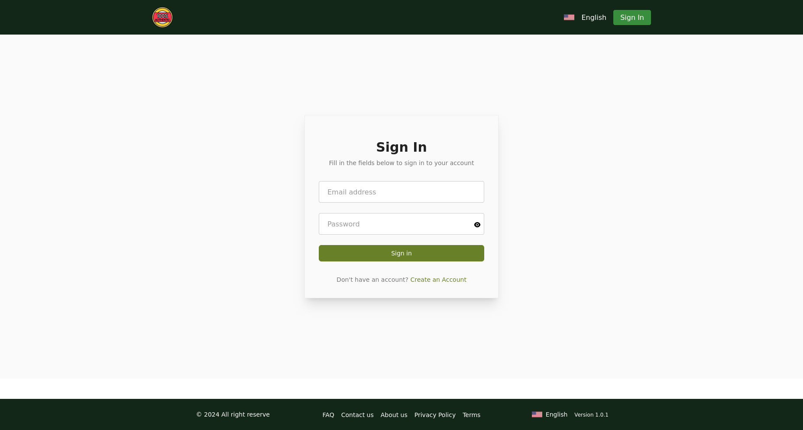

# Authentication Form Project

This project is a multi-step authentication form designed with error validation, custom input fields, and a responsive design. It utilizes JavaScript, TypeScript, and React.js to create a seamless user experience.

## Features

- Multi-step form for intuitive user interaction
- Error validation to ensure accurate data entry
- Custom input fields for a unique design
- Responsive design for compatibility across devices

## Technology Stack

- JavaScript
- TypeScript
- React.js

## JSON Object Design

The JSON object design of this project allows for easy manipulation of content. You can modify the object content to suit your specific requirements.

## Installation

1. Clone the repository:

   ```bash
   git clone https://github.com/hr-sobuj/auth-form.git
   ```

2. Navigate to the project directory:

   ```bash
   cd auth-form
   ```

3. Install dependencies using npm:

   ```bash
   npm install
   ```

   Or using Yarn:

   ```bash
   yarn install
   ```

   Or using pnpm:

   ```bash
   pnpm install
   ```

4. If you haven't installed `bun` globally, you can do so using npm:

   ```bash
   npm install -g bun
   ```

5. To run the project with `bun`, execute:

   ```bash
   bun run dev
   ```

   Alternatively, you can use `bun` to install and start the project:

   ```bash
   bun install
   bun start
   ```

## Repository Link

[Authentication Form Repo](https://github.com/hr-sobuj/auth-form)

## Live Demo

[Authentication Form Live Demo](https://auth-form-gold.vercel.app/)

## Screenshot


